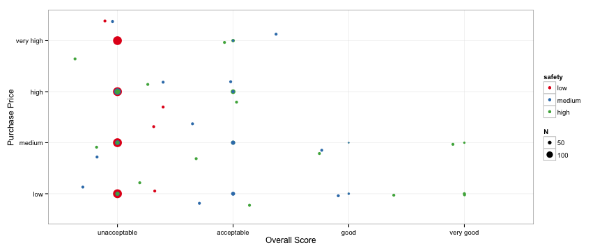

## Introduction

Choosing a new or used car can be a stressful, complicated process involving many factors.  What if there were an easy way to rank potential vehicles based on a few key attributes?  Our ShinyApp tool does just that!  Select values for the following characteristics, and the tool will give your potential new car an overall score.

* Purchase Price   
* Maintenance Cost   
* Number of Doors  
* Number of Passengers   
* Cargo Capcity  
* Overall Safety Rating  

--- 

## How does it work?  

We used a publically available data set of over 1000 car evaluations to build a prediction model.  These evaluations included data on the same six attributes we are asking you to enter, as well as an overall score determined by scientists at UCI.  The four possible scores are unacceptable, acceptable, good and very good.  

<b>Give it a try</b>    
You can try our tool out at <a href="https://skairs.shinyapps.io/9_DataProducts/">our shinyapps.io page</a>.  Please give the tool a few moments to load and then select your car's attributes from the drop down menus in the left sidebar.  

--- 

## How does my car compare to other, similar cars?  

Purchase Price and Safety are two key features in determining the overall score for a car.  As this plot demonstrates, a car must be relatively inexpensive and very safe to get a Very Good rating from UCI.  It is possible to get a Good rating with medium safety, or every an Acceptable rating with higher prices.  Low safety scores always earn cars an Unacceptable rating.

--- 

## Acknowledgements

Thank you to UCI's Machine Learning Repository for free access to the Car Evaluation Data Set and to Professors Caffo, Leek and Peng from JHU's Bloomberg School of Public Health for their publically available Coursera Data Science Specialization classes.  

<b>UCI Machine Learning Repository</b>  
Car Evaluation Data Set  
Bache, K. & Lichman, M. (2013). UCI Machine Learning Repository [http://archive.ics.uci.edu/ml]. Irvine, CA: University of California, School of Information and Computer Science.  

<b>Johns Hopkins Data Science Specialization at Coursera</b>  
<a href="http://www.jhu.edu">Johns Hopkins University</a>, Bloomberg School of Public Health  
<a href="http://coursera.org">Coursera</a>  
